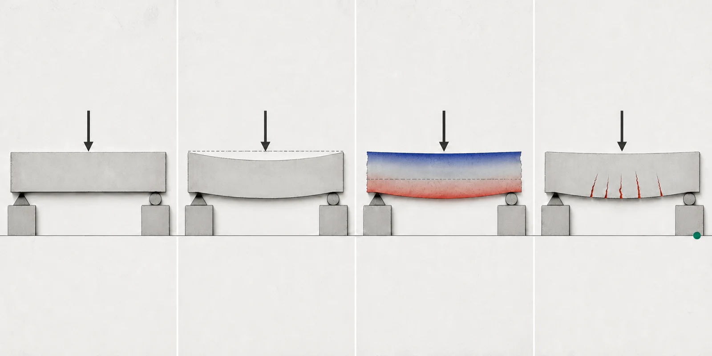

# F0｜把结构切开看



材料力学与结构设计之间并没有一道墙。前者训练我们把看不见的内力、应力和变形画出来，后者要求我们在材料非线性、构造和规范约束下作选择。本章只建立一套以后反复使用的语言。

::: {.question-band}
一根杆被两端拉住，外表没有变化。你凭什么说它内部“有力”？先不要写公式：画出你准备保留的物体，以及环境通过哪些接触把作用传给它。
:::

## 概念｜六步读懂一个受力问题 {#concept}

1. **选对象**：整座桥、一个构件，还是切口一侧？
2. **画边界**：对象与环境在哪里分开？
3. **替代接触**：把支座、连接、分布作用换成力与力矩。
4. **列平衡**：先判断能否仅靠静力平衡求解。
5. **切开构件**：用轴力 $N$、剪力 $V$、弯矩 $M$、扭矩 $T$ 表示切口两侧的相互作用。
6. **连接变形**：平衡只告诉我们“必须传多少”，几何关系和材料关系才告诉我们“怎样变形、怎样分配”。

应力不是新的外力，而是内力在截面上的分布。正应力垂直于截面，切应力沿截面。应变不是位移本身，而是局部长度或角度的相对改变。

## 洞察｜三类关系贯穿全书 {#insight}

几乎所有构件分析都在反复闭合三个环节：

- **平衡**：外力与内力是否相容；
- **几何/协调**：变形后各部分是否仍能连接；
- **材料关系**：应力与应变怎样对应。

材料力学常把材料理想为连续、均匀、线弹性；结构设计则进一步处理开裂、屈服、徐变、收缩、黏结滑移与构造限制。复杂度增加了，骨架没有变。

::: {.student-evidence}
最常见的错误不是不会解方程，而是自由体没选清楚便开始代数。每次计算前用一句完整的话说明：“我保留的是……，切掉的部分用……替代。”
:::

## 样例｜同一根悬臂，三种尺度 {#example}

在端部受竖向力 $P$ 的悬臂梁上：

- 看整根梁：固定端反力为 $P$，反力矩为 $PL$；
- 在距自由端 $x$ 处切开：切口必须提供剪力 $P$ 和弯矩 $Px$；
- 看切口上一点：弯矩主要表现为沿高度改变符号的正应力，剪力表现为非均匀切应力。

这不是三套知识，而是“外部作用—截面合力—局部分布”三个放大倍数。

<figure class="concept-metaphor">
  
  <figcaption><strong>概念隐喻 · AI 生成，不是工程证据</strong>不要一次解释四幅图。先遮住右侧，只问“荷载进来后，最先能看见什么”；再逐幅打开，把同一根梁从外部动作追到内部状态。箭头、公式和尺寸以本页确定性图解为准。</figcaption>
</figure>

<iframe data-src="https://www.youtube-nocookie.com/embed/aQf6Q8t1FQE?start=34" title="An Introduction to Stress and Strain" loading="lazy" allowfullscreen></iframe><noscript class="video-fallback">
<a href="https://www.youtube.com/watch?v=aQf6Q8t1FQE&amp;t=34s">在原平台打开核心时刻 00:34</a>
</noscript>

### 中文分段导看（原创意译与概括）

| 约略时段 | 看什么 | 中文要点 |
|---|---|---|
| 00:00–02:10 | 外力怎样进入物体 | 应力描述材料内部抵抗外载的分布，不等于外力除以任意面积。 |
| 02:10–04:20 | 正应力与切应力 | 区分“垂直截面”与“沿截面”，先看方向再选公式。 |
| 04:20–07:50 | 应变与材料曲线 | 同样的应力，不同材料可能产生完全不同的应变与永久变形。 |
| 07:50–结尾 | 斜截面 | 同一点换一个观察平面，正应力和切应力分量会改变。 |

**一句话总结：** 外力可见，内部的应力与应变不可见；材料力学的任务是建立两者之间可检验的联系。

**术语：** stress 应力；strain 应变；normal stress 正应力；shear stress 切应力；yielding 屈服。

视频：The Efficient Engineer。分段时间为学习导航，并非字幕逐字翻译。可在播放器中启用英文字幕。

再看两段｜把应力语言放回自由体与中文短讲

<article class="video-clip">
<iframe data-src="https://www.youtube-nocookie.com/embed/qPaqDfRKBI4?start=298" title="Statics Free Body Diagram" loading="lazy" allowfullscreen></iframe><noscript class="video-fallback">
<a href="https://www.youtube.com/watch?v=qPaqDfRKBI4&amp;t=298s">在原平台打开核心时刻 04:58</a>
</noscript>
<h3>2｜先选对象，再列平衡</h3>
从约04:58跟随 Purdue 的自由体步骤；每出现一个力，都说出它来自哪个被切掉的接触。

Purdue MET · 约04:58起
</article>
<article class="video-clip">
<iframe data-src="https://player.bilibili.com/player.html?bvid=BV1gdQaYjE81&autoplay=0&t=316" title="工程力学：应力" loading="lazy" allowfullscreen></iframe><noscript class="video-fallback">
<a href="https://www.bilibili.com/video/BV1gdQaYjE81/?t=316">在原平台打开核心时刻 05:16</a>
</noscript>
<h3>3｜中文短讲：应力</h3>
用六分钟复述“外力—内力—截面分布”，看完后给正应力和切应力各画一个方向图。

Bilibili · 北京化工大学官成宇
</article>

## 实际应用｜从雨棚节点到整座桥 {#application}

雨棚拉杆的轴力、梁柱节点的剪力、箱梁的扭矩、桥墩的轴力与弯矩，本质上都是结构体系把荷载送往地基时留下的“中转记录”。真实设计必须再问：

- 这条力路是否连续？
- 连接能否把合力真正传过去？
- 刚度变化会不会把力推向意外位置？
- 施工阶段是否出现另一条控制力路？

曼彻斯特大学的 [Seeing and Touching Structural Concepts](https://epsassets.manchester.ac.uk/structural-concepts/) 把平衡、弯曲、剪扭、力路与失稳分别用模型演示。建议先观察模型，再回到公式解释观察，而不是反过来。

## 拓展｜什么时候平衡不够 {#extension}

一根两端固定、受温度变化的杆，即使没有外加轴向力也可能产生内力。仅列平衡无法求出它，因为未知反力多于独立平衡方程。此时必须加入温度应变、弹性变形与端部位移约束。

这给出以后识别超静定问题的最小判断：**未知作用不仅要平衡，还必须让结构变形得“接得上”。**

::: {.model-boundary}
本章公式默认小变形、连续介质和准静力过程。冲击、疲劳、断裂、明显塑性和几何大变形需要额外模型；不能因为画出了内力图，就假装所有失效模式都被覆盖。
:::
