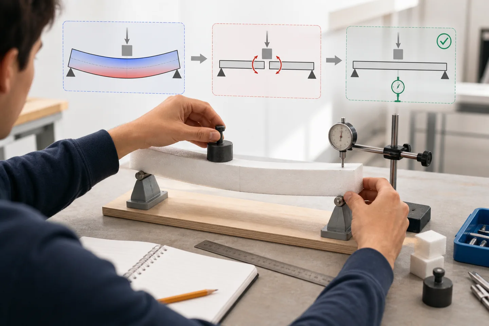

# 写在前面：我们为什么重新写一门课

很多学生第一次打开《结构设计原理》，看到的不是结构，而是一堵由符号、系数、表格和构造规定砌成的墙。他们可能学会把数字代进公式，却没有看见梁怎样弯、裂缝为什么出现、钢筋为什么放在那里，更没有机会回答一个真正属于设计的问题：**如果结果不好，我还能改变什么？**

这本书从另一个方向出发。它不以“把知识讲完”为完成标准，而以学生能否完成以下动作作为判断：

- 看见结构正在发生什么；
- 用自己的语言作出预测；
- 从预测走向简化模型；
- 在多个可行方案之间作出选择；
- 对计算、程序和AI结果进行验证；
- 把一个构件重新放回桥梁与真实环境。

<figure class="concept-metaphor">

<figcaption><strong>概念隐喻 · AI 生成，不是工程证据</strong>　推导不是看老师把黑板写满，而是你先碰到一个现象，再把它切开、说清关系，最后用测量或反例检查。图像只表达学习路径，不可用于判断真实构件受力。</figcaption>
</figure>

## 我们拒绝什么

我们不把作者和专家名单当作教材有效性的证明，不把章节覆盖率当作学习质量，不把学生的沉默当作理解，也不把一次期末考试当作唯一反馈。

工程知识当然需要严谨。规范、公式、边界条件和构造要求都不能被兴趣活动取代。但严谨不等于晦涩，专业性也不等于必须从结论和规定开始。真正的严谨，是让学生知道一个结论从哪里来、在什么条件下成立、怎样可能出错，以及怎样重新验证。

## 这本书从哪里来

正文来自持续多年的课程录音、转写、课堂活动、学生作品、教师复盘和交互工具开发记录。口语转写不是直接出版的正文：它先被保存为课堂档案，再提炼其中反复出现的教学主张、真实互动和认识变化，最后重新写成适合阅读的章节。

因此，本书刻意保留三种通常会从教材中消失的东西：

1. **课堂现场。** 学生怎么说、哪里犹豫、什么类比真正促成了理解；
2. **错误历史。** 公式被误解、程序算错、参数趋势不合理以后，怎样定位和复验；
3. **观点变化。** 一个教学活动最初为何设计，使用以后又为什么被修改。

::: {.source-note}
本书不收录既有教材全文。既有教材只用于定位知识、核对公式和追踪规范来源。课堂录音中的学生信息均不进入公开正文；只有经过匿名、对理解有必要的证据才可能被概括使用。
:::

## AI的位置

AI已经可以迅速完成配筋计算、绘制参数图、生成网页和解释公式。继续把大量教学时间用于重复手算，并不能自动培养更可靠的工程师。学生更需要学习的是：问题有没有被正确表达？模型是否适用？单位是否一致？趋势是否符合力学？换一个算例还能不能成立？

本书中的AI承担四种角色：档案整理者、可视化工具制作者、参数试算员和对抗性审稿人。它不拥有最后解释权。每一个AI生成结果，都必须接受四重校核：

1. 单位和数量级；
2. 已知算例；
3. 趋势与极限；
4. 独立算例。

## 给读者的约定

不要急着得到正确答案。每当页面出现“你先判断”，先留下一个选择，即使只有直觉。操作交互以后，不要只看红绿提示，要说出哪个变量改变了、结构内部发生了什么、你的判断为什么需要修改。

工程判断不是从从不犯错开始，而是从愿意让错误暴露、留下证据并再次验证开始。

